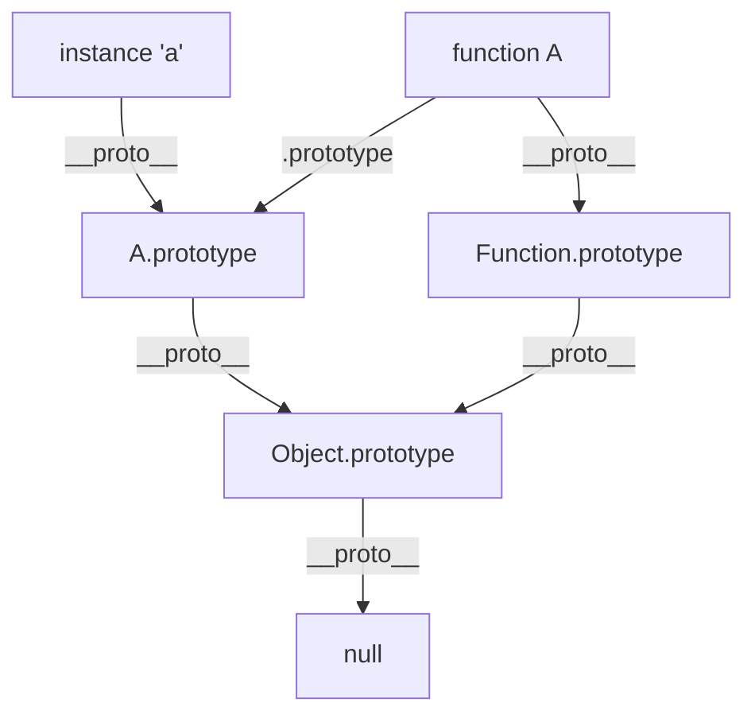
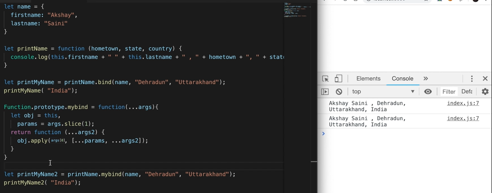

# Event Loop, Prototype, Call, Apply and Bind Methods

---

## 1. The Event Loop

### Definition

The **Event Loop** is the mechanism that allows JavaScript to perform non-blocking I/O operations, despite being single-threaded. It constantly monitors the **Call Stack** and the **Callback Queue**. When the Call Stack is empty, it takes the first event from the queue and pushes it onto the stack for execution.

### Web APIs

JavaScript engines (like V8) do not run in isolation. They run in environments like Browsers or Node.js, which provide **Web APIs**. These APIs handle tasks that are not part of the JS language itself but are available to it:

- `setTimeout()` / `setInterval()`
- `fetch()` (Network requests)
- DOM Events (clicks, scrolls)
- Geolocation / LocalStorage

### Callback Queue (Macro Task Queue)

This queue stores "Macro Tasks" that are ready to be executed after being processed by the Web APIs.

- **Examples**: `setTimeout`, `setInterval`, `setImmediate` (Node.js).

### Microtask Queue

This is a high-priority queue. The Event Loop checks the Microtask Queue **immediately after** every task in the Call Stack finishes, and before moving to the next Macro Task.

- **Examples**: `Promise` callbacks (`.then`, `.catch`, `.finally`), `MutationObserver`.

### Working of the Event Loop

1.  **Execute Synchronous Code**: All code in the script runs line by line and is pushed onto the **Call Stack**.
2.  **Offload Async Tasks**: When an async task (like `setTimeout`) is encountered, it is sent to the **Web APIs**.
3.  **Queue the Callbacks**: Once the Web API finishes (e.g., the timer ends), the callback is moved to either the **Microtask Queue** or the **Callback Queue**.
4.  **Check Call Stack**: The Event Loop waits until the **Call Stack is empty**.
5.  **Prioritize Microtasks**: All tasks in the **Microtask Queue** are executed one by one.
6.  **Execute Macro Task**: Finally, the first task from the **Callback Queue** is pushed to the Call Stack.

### Starvation

**Starvation** occurs when the Microtask Queue is so busy that the Callback Queue (Macro Tasks) never gets a chance to execute. Since the Event Loop processes _all_ available microtasks before moving to the next macro task, a recursive promise loop can "starve" the UI or timers.

#### Example of Potential Starvation:

```javascript
function infinitelyResolvedPromise() {
  Promise.resolve().then(infinitelyResolvedPromise);
}
// This will block the event loop from ever picking up a setTimeout or click event!
```

---

## 2. Prototypes and Prototypal Inheritance

### Definition

In JavaScript, every object has a private property which holds a link to another object called its **Prototype**. That prototype object has a prototype of its own, and so on until an object is reached with `null` as its prototype.

### Prototypal Chain

When you try to access a property on an object:

1.  JS checks the object itself.
2.  If not found, it checks the object's **prototype** (`__proto__`).
3.  If still not found, it continues up the **Prototype Chain** until it reaches `Object.prototype`.
4.  If it reaches `null`, it returns `undefined`.

### Example

```javascript
let animal = {
  eats: true,
  walk() {
    console.log("Animal walks");
  },
};

let rabbit = {
  jumps: true,
  __proto__: animal, // rabbit inherits from animal
};

console.log(rabbit.eats); // true (found in prototype)
rabbit.walk(); // "Animal walks" (found in prototype)
```

### Prototypal Inheritance vs. Classical Inheritance

- **Classical**: Classes create blueprints. Objects are instances of these blueprints.
- **Prototypal**: Objects inherit directly from other objects. It's more flexible and memory-efficient as methods are shared via the chain rather than copied.

### Deep Dive into Prototype Chain

To understand the difference between `.prototype` and `.__proto__`, let's analyze a constructor function and its instance.

**Important Note:**

- `prototype`: A property that exists **only on functions**. It is the object that will be assigned as `__proto__` to any instance created using the `new` keyword.
- `__proto__`: A property that exists on **every object**. It points to the prototype of the constructor that created it.

```javascript
function A() {}
const a = new A();

// 1. Where do functions inherit from?
console.log(A.__proto__); // [Function: Empty] -> Pointing to Function.prototype
console.log(A.__proto__ === Function.prototype); // true

// 2. What is the blueprint for instances of A?
console.log(A.prototype); // { constructor: f A() } -> The object 'a' will inherit from

// 3. Where does the instance 'a' point for inheritance?
console.log(a.__proto__); // { constructor: f A() } -> This IS A.prototype
console.log(a.__proto__ === A.prototype); // true

// 4. Do instances have a .prototype property?
console.log(a.prototype); // undefined -> (Only functions have this property)

// 5. Following the chain upwards:
console.log(A.prototype.__proto__); // [Object: null prototype] {} -> Pointing to Object.prototype
console.log(A.prototype.__proto__ === Object.prototype); // true

// 6. The end of the chain:
console.log(a.__proto__.__proto__); // Object.prototype
console.log(a.__proto__.__proto__.__proto__); // null (The very end of the prototype chain)

// 7. Common Pitfalls / Errors:
// console.log(a.prototype.prototype);        // TypeError: Cannot read property 'prototype' of undefined
// console.log(A.__proto__.prototype);        // undefined (Function.prototype itself doesn't have a .prototype)
```

### The Prototype Visual Chain



### Table Summary

| Accessor                     | Property Type        | Use Case                                        |
| :--------------------------- | :------------------- | :---------------------------------------------- |
| `Object.prototype`           | Static Property      | The final blueprint for all JS objects.         |
| `Func.prototype`             | Property on Function | Defines what properties instances will inherit. |
| `obj.__proto__`              | Reference/Dunder     | Shows the actual object being inherited from.   |
| `Object.getPrototypeOf(obj)` | Method               | The modern, standard way to access `__proto__`. |

---

## 3. `call`, `apply`, and `bind` Methods

These are three powerful methods provided by the `Function.prototype` that allow you to explicitly set the `this` context for any function.

```javascript
let user1 = { firstName: "Rahul", lastName: "Khatwani" };
let user2 = { firstName: "Abhishek", lastName: "Sharma" };

function printInfo(town, state) {
  console.log(`${this.firstName} ${this.lastName} is from ${town}, ${state}`);
}
```

### 1. `call` Method

Invokes the function immediately with the provided `this` context and arguments passed **individually**.

```javascript
printInfo.call(user1, "Ajmer", "Rajasthan");
// Output: Rahul Khatwani is from Ajmer, Rajasthan
```

### 2. `apply` Method

Exactly like `call`, but arguments are passed as an **array**.

```javascript
printInfo.apply(user2, ["Jaipur", "Rajasthan"]);
// Output: Abhishek Sharma is from Jaipur, Rajasthan
```

### 3. `bind` Method

Doesn't invoke the function. Instead, it returns a **new function** that can be called later, with the `this` context and initial arguments "bound" to it.

```javascript
let boundFunc = printInfo.bind(user1, "Ajmer", "Rajasthan");
boundFunc(); // Output: Rahul Khatwani is from Ajmer, Rajasthan
```

---

## 4. Polyfills for `call`, `apply`, and `bind`

Polyfills are custom implementations of these built-in methods, used to understand how they work under the hood.

### Polyfill for `call`

The core idea is to attach the function to the object as a temporary property, execute it, and then delete it.

```javascript
Function.prototype.myCall = function (context, ...args) {
  let obj = context || window; // Default to global scope
  let uniqueID = Symbol(); // Avoid colliding with existing properties
  obj[uniqueID] = this; // 'this' is the function being called

  let result = obj[uniqueID](...args);
  delete obj[uniqueID];
  return result;
};
```

### Polyfill for `apply`

Same as `myCall`, but handles arguments passed as an array.

```javascript
Function.prototype.myApply = function (context, argsArray) {
  let obj = context || window;
  let uniqueID = Symbol();
  obj[uniqueID] = this;

  let result = obj[uniqueID](...argsArray);
  delete obj[uniqueID];
  return result;
};
```

### Polyfill for `bind`

Returns a new function that internally uses `apply` to execute with the correct context.

```javascript
Function.prototype.myBind = function (context, ...args1) {
  let fn = this; // The original function
  return function (...args2) {
    return fn.apply(context, [...args1, ...args2]);
  };
};
```

### Refer to the following logic for the Polyfill implementation:



---

## 5. Important Interview Questions

### Q1. What happens internally when you use the `new` keyword?

When you use the `new` keyword, JavaScript performs a four-step process behind the scenes to create an instance of a constructor function.

#### The Step-by-Step Manual Breakdown:

Imagine we have a simple constructor function:

```javascript
function Person(name) {
  this.name = name;
}
const p1 = new Person("Rahul");
```

Here is exactly what the JS engine does:

1.  **Creates a brand new empty object**:
    `const obj = {};`
    _Think of it as grabbing a fresh, blank notebook._

2.  **Links the object to the constructor's prototype**:
    `obj.__proto__ = Person.prototype;`
    _This ensures the new object can access shared methods (like `Person.prototype.sayHi`)._

3.  **Binds `this` and executes the constructor**:
    `Person.call(obj, "Rahul");`
    _Inside the function, `this` now refers to our new `obj`. Properties are assigned to it._

4.  **Returns the object**:
    _Unless the constructor explicitly returns a **different object**, the new `obj` is automatically returned._

#### ⚠️ Special Case: Explicit Returns

- If you `return { age: 25 }` (an **object**) from the constructor, `new` will return that object instead.
- If you `return 5` (a **primitive**), it is ignored, and the instance created by `new` is returned as usual.

---

### Q2. Why should methods be added to the `prototype` instead of the constructor?

Adding methods directly inside the constructor is often considered bad practice due to **memory efficiency**.

#### Scenario A: Methods in Constructor (Memory Heavy)

```javascript
function User(name) {
  this.name = name;
  this.sayHi = function () {
    // CREATED NEW FOR EVERY INSTANCE
    console.log("Hi " + this.name);
  };
}
const u1 = new User("A");
const u2 = new User("B");
console.log(u1.sayHi === u2.sayHi); // false (Two different functions in memory)
```

_If you have 1,000 users, you now have 1,000 identical `sayHi` functions taking up space in RAM._

#### Scenario B: Methods on Prototype (Memory efficient)

```javascript
function User(name) {
  this.name = name;
}
User.prototype.sayHi = function () {
  // CREATED ONLY ONCE
  console.log("Hi " + this.name);
};

const u1 = new User("A");
const u2 = new User("B");
console.log(u1.sayHi === u2.sayHi); // true (Shared reference)
```

_No matter how many users you create, there is only **one** `sayHi` function stored in memory. All instances point to it via their prototype chain._

---

### Q3. What happens when you use the `new` keyword with a `bind()` function?

This is a tricky interview question that tests your understanding of **this binding precedence**.

#### The Code Challenge:

```javascript
function Person(name) {
  this.name = name;
}

// We bind Person to a specific object { x: 1 }
const BoundPerson = Person.bind({ x: 1 });

// We use 'new' on the bound function
const p1 = new BoundPerson("Rahul");

console.log(p1.name); // Output: "Rahul"
console.log(p1.x); // Output: undefined ❓
```

#### The Explanation:

When you use the `new` keyword, JavaScript's internal logic for creating a new object **overrides** the hard-binding created by `.bind()`.

1.  **Precedence Rule**: In JavaScript, the `new` binding has **higher priority** than the explicit binding created by `.bind()`.
2.  **Internal Step**: As we saw in Q1, the `new` keyword creates a fresh empty object (`{}`) and forces the function's `this` to point to that fresh object.
3.  **The Result**: Even though `BoundPerson` was told to use `{ x: 1 }` as its context, the `new` operator "stole" the context back and redirected it to the newly created instance `p1`.

_Consequently, `p1.x` is `undefined` because `x` exists only on the object that was ignored (`{ x: 1 }`), not on the new instance `p1`._
