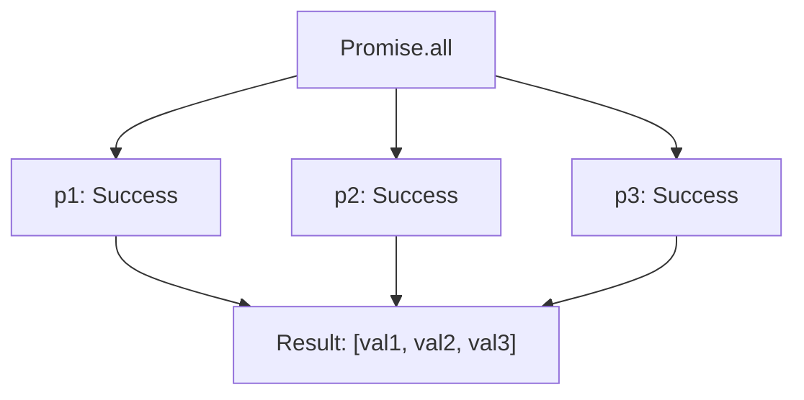
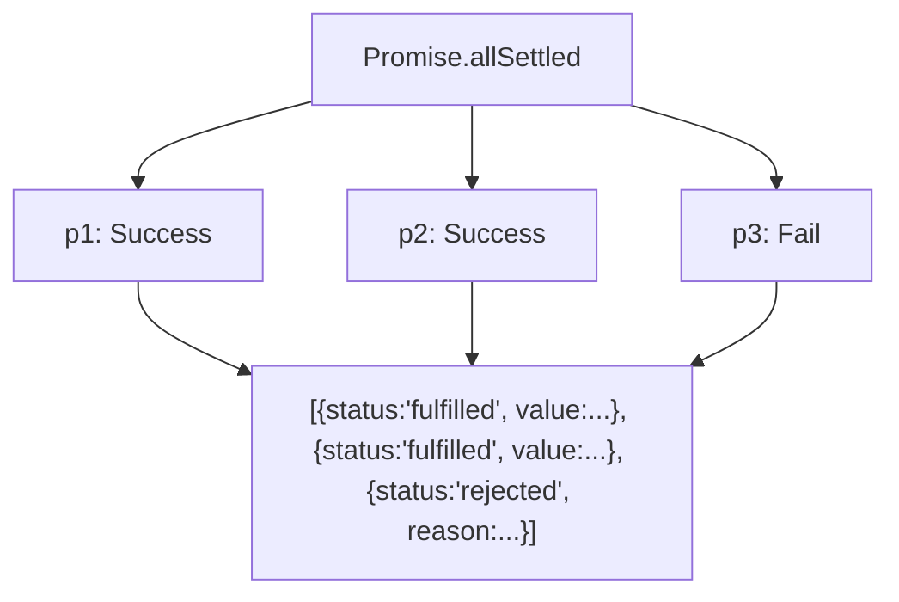
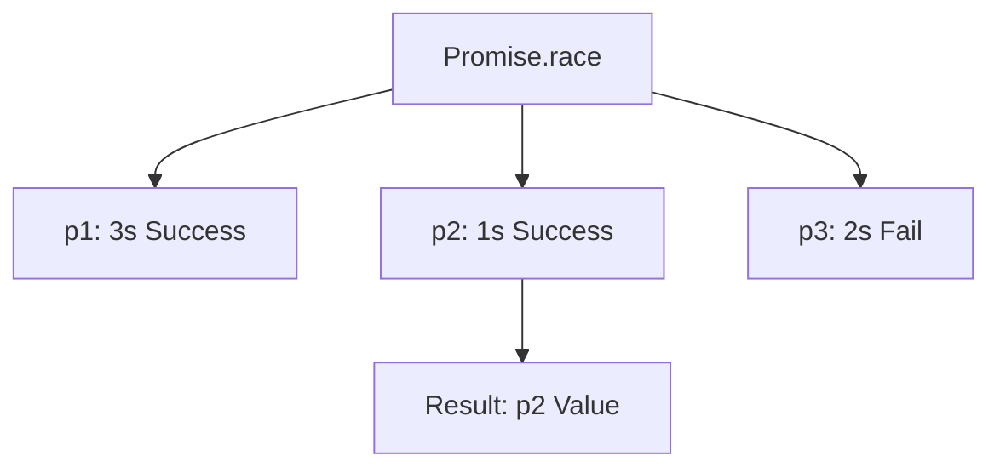

# Promise APIs and async-await

JavaScript provides several built-in methods (APIs) to handle multiple promises simultaneously. These are essential for managing parallel asynchronous operations.

---

## 1. Quick Comparison Table

| API                        | Success Condition        | Failure Condition       | Result                                      |
| :------------------------- | :----------------------- | :---------------------- | :------------------------------------------ |
| **`Promise.all()`**        | All promises fulfill     | Any promise rejects     | Array of values / First error               |
| **`Promise.allSettled()`** | All promises settle      | Never rejects           | Array of objects with status/value/reason   |
| **`Promise.race()`**       | First promise to settle  | First promise to settle | Value or error of the first settled promise |
| **`Promise.any()`**        | First promise to fulfill | All promises reject     | Value of first success / AggregateError     |

---

## 2. `Promise.all([p1, p2, p3...])`

Wait for **all** promises to be fulfilled. If **any** fail, the whole thing fails immediately.

### Behavior:



### Examples (from Screenshots):

- **Success Case (All Fulfillment):**

  ```javascript
  const p1 = new Promise((resolve, reject) => {
    setTimeout(() => resolve("P1 Success"), 3000);
  });
  const p2 = new Promise((resolve, reject) => {
    setTimeout(() => resolve("P2 Success"), 1000);
  });
  const p3 = new Promise((resolve, reject) => {
    setTimeout(() => resolve("P3 Success"), 2000);
  });

  Promise.all([p1, p2, p3]).then((res) => {
    console.log(res);
  });
  // Output after 3s: ["P1 Success", "P2 Success", "P3 Success"]
  ```

- **Failure Case (Fail Fast):**

  ```javascript
  const p1 = new Promise((resolve, reject) => {
    setTimeout(() => resolve("P1 Success"), 3000);
  });
  const p2 = new Promise((resolve, reject) => {
    setTimeout(() => reject("P2 Fail"), 1000); // Fails after 1 second
  });
  const p3 = new Promise((resolve, reject) => {
    setTimeout(() => resolve("P3 Success"), 2000);
  });

  Promise.all([p1, p2, p3])
    .then((res) => console.log(res))
    .catch((err) => console.error(err));
  // Output after 1s: "P2 Fail"
  ```

---

## 3. `Promise.allSettled([p1, p2, p3...])`

Waits for **all** promises to finish, regardless of whether they succeed or fail. It never rejects.

### Behavior:



### Example (from Screenshot):

```javascript
const p1 = new Promise((resolve, reject) => {
  setTimeout(() => resolve("P1 Success"), 3000);
});
const p2 = new Promise((resolve, reject) => {
  setTimeout(() => resolve("P2 Success"), 1000);
});
const p3 = new Promise((resolve, reject) => {
  setTimeout(() => reject("P3 Fail"), 2000); // Rejects after 2 seconds
});

Promise.allSettled([p1, p2, p3])
  .then((res) => console.log(res))
  .catch((err) => console.error(err));

/* Output after 3s:
[
  { status: "fulfilled", value: "P1 Success" },
  { status: "fulfilled", value: "P2 Success" },
  { status: "rejected", reason: "P3 Fail" }
]
*/
```

---

## 4. `Promise.race([p1, p2, p3...])`

The first promise to **settle** (either resolve or reject) wins.

### Behavior:



### Example (Timeout logic):

```javascript
const p1 = new Promise((resolve, reject) => {
  setTimeout(() => resolve("P1 Success"), 3000);
});
const p2 = new Promise((resolve, reject) => {
  setTimeout(() => resolve("P2 Success"), 1000);
});
const p3 = new Promise((resolve, reject) => {
  setTimeout(() => reject("P3 Fail"), 2000);
});

Promise.race([p1, p2, p3])
  .then((res) => console.log(res))
  .catch((err) => console.error(err));
// Output after 1 seconds: "P2 Success"
```

- **Failure Case (Fail Fast):**

```javascript
const p1 = new Promise((resolve, reject) => {
  setTimeout(() => resolve("P1 Success"), 3000);
});
const p2 = new Promise((resolve, reject) => {
  setTimeout(() => resolve("P2 Success"), 5000);
});
const p3 = new Promise((resolve, reject) => {
  setTimeout(() => reject("P3 Fail"), 2000);
});

Promise.race([p1, p2, p3])
  .then((res) => console.log(res))
  .catch((err) => console.error(err));
// Output after 2 seconds: "P3 Fail"
```

---

## 5. `Promise.any([p1, p2, p3...])`

Wait for the **first successful** promise. It ignores rejections unless **all** promises fail.

### Behavior:


### Example:

```javascript
const p1 = new Promise((resolve, reject) => {
  setTimeout(() => resolve("P1 Success"), 3000);
});
const p2 = new Promise((resolve, reject) => {
  setTimeout(() => resolve("P2 Success"), 5000);
});
const p3 = new Promise((resolve, reject) => {
  setTimeout(() => reject("P3 Fail"), 2000);
});

Promise.any([p1, p2, p3])
  .then((res) => console.log(res))
  .catch((err) => console.error(err));
// Output after 3s: "P1 Success"
```

> [!CAUTION]
> If all promises fail (rejected), `Promise.any` returns an `AggregateError` containing all individual errors in the `errors` property.

```javascript
const p1 = new Promise((resolve, reject) => {
  setTimeout(() => reject("P1 Fail"), 3000);
});
const p2 = new Promise((resolve, reject) => {
  setTimeout(() => reject("P2 Fail"), 5000);
});
const p3 = new Promise((resolve, reject) => {
  setTimeout(() => reject("P3 Fail"), 2000);
});

Promise.any([p1, p2, p3])
  .then((res) => console.log(res))
  .catch((err) => console.error(err));
// Output after 5s: AggregateError: All promises were rejected
// If console.error(err.errors) is used, then output 5s: ["P1 Fail", "P2 Fail", "P3 Fail"]
```

---

## 6. Async-Await

`async` and `await` are syntactic sugar built on top of Promises. They provide a cleaner way to write asynchronous code that looks and behaves like synchronous code.

### Key Rules:

- **`async`** functions always return a **Promise**. If you return a non-promise value, JS wraps it in a resolved Promise automatically.
- **`await`** can only be used inside an `async` function.
- When `await` is encountered, the execution of the function is **suspended** (it moves off the call stack), allowing the main thread to continue other tasks. It resumes once the promise settles.

### Understanding Execution Timing

#### Case 1: Defining Promises Globally (Starts Immediately)

If promises are created outside the function, their timers start **at the same time** (in parallel).

```javascript
const p1 = new Promise((resolve) =>
  setTimeout(() => resolve("P1 Success"), 10000),
); // 10s timer
const p2 = new Promise((resolve) =>
  setTimeout(() => resolve("P2 Success"), 5000),
); // 5s timer

async function handlePromise() {
  console.log("Start");

  const val1 = await p1; // Function suspends for 10s
  console.log(val1); // Prints "P1 Success" after 10s

  const val2 = await p2; // p2 already resolved 5s ago!
  console.log(val2); // Prints "P2 Success" IMMEDIATELY after p1
}
```

#### Case 2: Defining Promises via Functions (Sequential Control)

If promises are created via function calls inside the `async` function, you can ensure they run one after another.

```javascript
async function promise1() {
  return new Promise((resolve) =>
    setTimeout(() => resolve("P1 Success"), 10000),
  );
}

async function promise2() {
  return new Promise((resolve) =>
    setTimeout(() => resolve("P2 Success"), 5000),
  );
}

async function handlePromise() {
  const val1 = await promise1(); // Starts timer, waits 10s
  console.log(val1);

  const val2 = await promise2(); // Starts timer ONLY AFTER p1 is done, waits 5s
  console.log(val2);
}
```

### Sequential vs Parallel Execution

| Pattern        | Code                            | Result                                               |
| :------------- | :------------------------------ | :--------------------------------------------------- |
| **Sequential** | `await a(); await b();`         | `b` waits for `a` to complete. Total time = `a + b`. |
| **Parallel**   | `await Promise.all([a(), b()])` | Both start together. Total time = `max(a, b)`.       |

---

## 7. Interview Question: Microtasks vs Macrotasks

**Question:** What will be the output order of the following code?

```javascript
console.log("A");

Promise.resolve(console.log("E"));

Promise.resolve().then(() => console.log("B"));

setTimeout(() => console.log("C"), 0);

console.log("D");
```

**Answer and Explanation:**

1.  **`A`**: Synchronous code, prints first.
2.  **`E`**: `console.log("E")` is an argument for `Promise.resolve`. JavaScript must evaluate the argument **before** creating the promise. Thus, it runs synchronously.
3.  **`D`**: Synchronous code, prints after all immediate expressions are evaluated.
4.  **`B`**: The `.then()` callback is pushed to the **Microtask Queue**.
5.  **`C`**: `setTimeout` is pushed to the **Macrotask Queue** (or Callback Queue).

> [!TIP]
> **Priority Rule:** Synchronous Code > Microtasks (Promises) > Macrotasks (setTimeout).

**Final Output: `A, E, D, B, C`**
