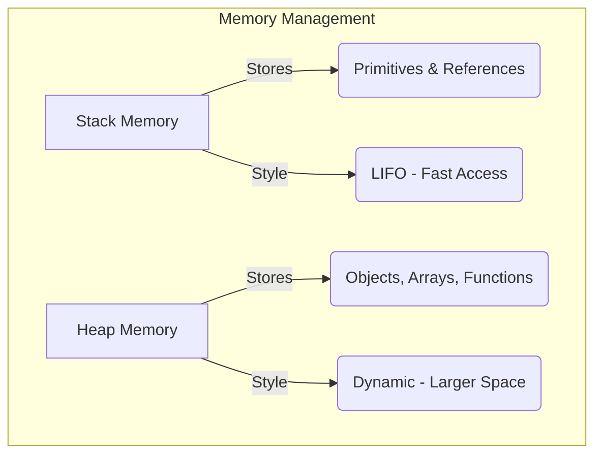
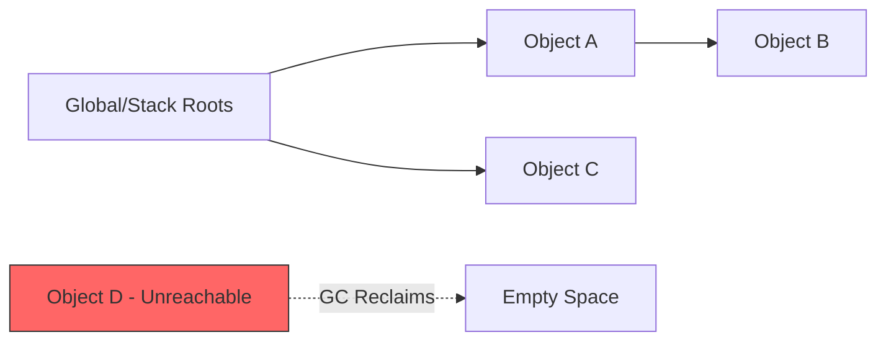
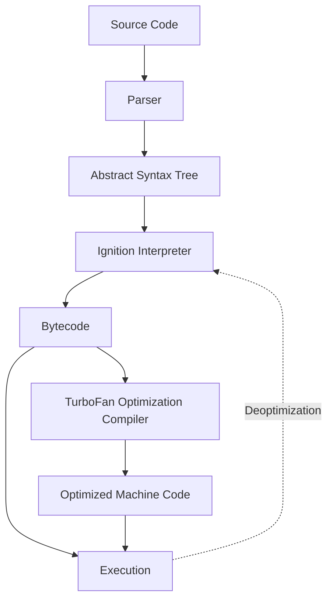

# Error Handling, Memory Leaks, Garbage Collection & JS Engine Architecture

Comprehensive guide to understanding how JavaScript handles errors, manages memory, and executes code at the engine level.

---

## 1. Error Handling in JavaScript

An error is an unexpected problem that interrupts normal program execution. If not handled, errors can crash your application or lead to unpredictable behavior.

### The `try...catch...finally` Block

The primary way to handle runtime errors in JavaScript.

```javascript
try {
  // Code that might throw an error
  const data = JSON.parse("{ invalid json }");
} catch (error) {
  // Executed if an error occurs
  console.error("Caught an error:", error.message);
} finally {
  // Always executes, regardless of whether an error was thrown
  console.log("Cleanup operations here.");
}
```

### Custom Error Throwing

You can manually throw errors using the `throw` keyword.

```javascript
function checkAge(age) {
  if (age < 18) {
    throw new Error("You must be at least 18 years old.");
  }
  return "Access granted";
}
```

### Common Built-in Error Types

| Error Type         | Description                        | Example                        |
| :----------------- | :--------------------------------- | :----------------------------- |
| **SyntaxError**    | Code violates language rules.      | `const 1n = "error";`          |
| **ReferenceError** | Variable is not defined.           | `console.log(nonExistentVar);` |
| **TypeError**      | Value is not of the expected type. | `null.f();`                    |
| **RangeError**     | Number is outside its valid range. | `new Array(-1);`               |
| **URIError**       | Incorrect use of URI functions.    | `decodeURI("%");`              |

### Global Error Handling

Catching errors that escape local `try...catch` blocks.

**Browser:**

```javascript
window.onerror = (message, source, lineno, colno, error) => {
  console.log("Global Log:", message);
  return true; // Prevents default browser error logging
};
```

**Node.js:**

```javascript
process.on("uncaughtException", (err) => {
  console.error("Critical System Failure:", err);
  process.exit(1);
});

process.on("unhandledRejection", (reason, promise) => {
  console.log("Unhandled Rejection at:", promise, "reason:", reason);
});
```

---

## 2. Memory Management

JavaScript manages memory automatically, but understanding how it works helps prevent performance bottlenecks.

### Stack vs. Heap Memory



- **Stack:** Used for static data (primitives like `Number`, `String`, `Boolean`) and function frames. It has fixed sizes and is very fast.
- **Heap:** Used for complex objects. It doesn't have a fixed size and requires more effort to manage (Garbage Collection).

### Garbage Collection (Mark-and-Sweep)

Modern JS engines use the **Mark-and-Sweep** algorithm to reclaim memory.

1.  **Mark**: The GC identifies "roots" (global variables, current stack) and "marks" everything reachable from them.
2.  **Sweep**: Any memory not marked is considered unreachable and is "swept" away.



---

## 3. Memory Leaks

A memory leak occurs when an object is no longer needed but is still referenced, preventing the GC from reclaiming it.

### Common Causes & Fixes

1.  **Global Variables:** Accidental globals (not using `let`/`const`) stay in memory forever.
    - _Fix:_ Use `"use strict";` or proper scoping.
2.  **Forgotten Timers:** `setInterval` keeping references to variables in its closure.
    - _Fix:_ Always use `clearInterval()`.
3.  **Closures:** A long-lived closure holding a reference to a large object.
4.  **Event Listeners:** Not removing listeners on DOM elements that are destroyed.
    - _Fix:_ Use `element.removeEventListener()`.
5.  **Detached DOM Nodes:** Holding a JS reference to a DOM element that has been removed from the UI.
    - _Fix:_ Set the JS variable to `null`.

---

## 4. JavaScript Engine Architecture (V8 Deep Dive)

The JS Engine is the program that executes your code. The most famous is **V8** (used in Chrome and Node.js).

### The Execution Pipeline



### Key Components

1.  **Parser:** Converts code into tokens and then an **AST** (a tree structure representing the code logic).
2.  **Ignition (Interpreter):** Converts AST into **Bytecode**. It's fast to start but not as efficient for long-running code.
3.  **TurboFan (JIT Compiler):** While the code runs, TurboFan monitors "hot" functions and compiles them into **Optimized Machine Code** for massive performance boosts.
4.  **Just-In-Time (JIT) Compilation:** JS is neither strictly interpreted nor compiled. It combines both for the best "Startup vs Execution" balance.

### Why does code "Deoptimize"?

If TurboFan makes an assumption (e.g., "This function always gets an Integer") and that assumption changes (e.g., it gets a String), the engine "deoptimizes" and falls back to the interpreted bytecode.

---

## Summary Best Practices

- **Handle Errors:** Use `try...catch` locally and global handlers for safety.
- **Clean Up:** Clear timers and remove event listeners to avoid leaks.
- **Engine Friendly Code:** Write "predictable" code (consistent types) to help TurboFan optimize your functions.
